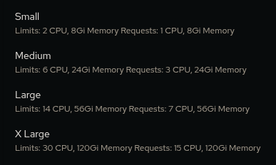
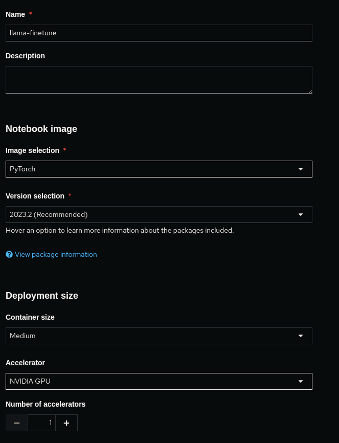
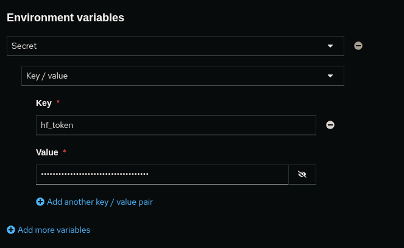
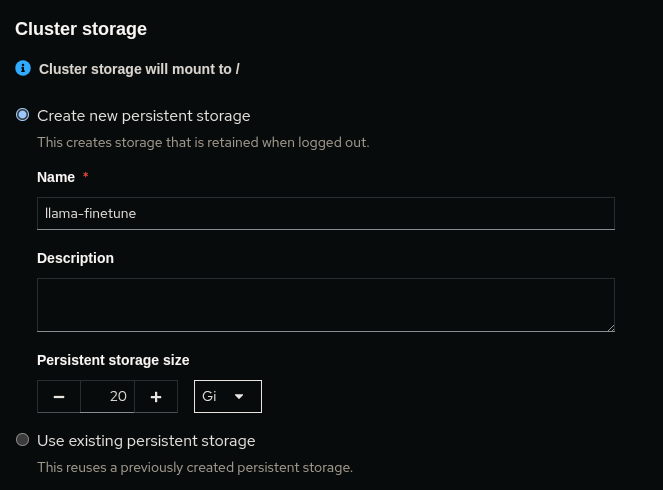

# serve a fine-tuned model from HuggingFace on OpenShift via RHOAI

Deploying a fine-tuned model from HuggingFace

- In HuggingFace.co
  - Create an account if you don't already have one
  - Obtain a token: https://huggingface.co/settings/tokens
  - You will use the token to set an environment variable in the DataScience Project later in these instructions. Optionally, you can create a secret directly in OpenShift to house the token via the following:

```yaml
kind: Secret
apiVersion: v1
metadata:
  name: huggingface-secret
  namespace: <namespace-goes-here>
type: Opaque
stringData:
  token: <token-goes-here>
```

- Create an OpenShift namespace - Easily do this by creating either a datascience project (as described below in the RHOAI section) or via the OpenShift web console
- In OpenShift
  - Create a Minio instance by following: https://ai-on-openshift.io/tools-and-applications/minio/minio/#deploy-minio-in-your-project
    - NOTE: You will need to update the default PVC size to >100Gi in the Minio deployment YAML to accommodate the model size / multiple models
  - Get the route
  - Get the secret: `minio`:`minio123`
  - Login to Minio
  - Create a bucket: `my-ai-bucket`
  - We will use this bucket to store the model we pull from HuggingFace. Note: For production, you would likely want to use a more secure method of storing the model, such as a private S3 bucket or a more secure Minio instance along with proper access controls.
- In RHOAI
  - Create a data science project: `<namespace-goes-here>`
  - Create a workbench:
    - Name: `llama-finetune`
    - Image Selection: `PyTorch`
    - Version selection: `2023.2 (Recommended)`
    - Container size: `Large` (Note: The convert step requires a lot of RAM: >30Gi(!) or it might stop prematurely. This is presumably because of some memory leak that is not controlled and since memory is not compressible the container running Jupyter is forced to restart)
      - 
    - Accelerator: `NVIDIA GPU`
    - Number of accelerators: `1`
    - 
  - Add an environment variable for your HuggingFace token:
    - Select `Secret` and then choose `Key/value`
    - Enter a Key: `hf_token`
    - Enter the value obtained from your HuggingFace account
    - Note: when you're in your Jupyter Notebook, you can use the `%env hf_token` to see the value of the environment variable and ensure it is indeed set correctly.
    - 
  - Create new persistent storage: `true` (selected)
    - Name: `llama-finetune`
    - Persistent storage size: `100 Gi` (this size depends on how big the models are that you'll be pulling down; note: the default 20Gi is not likely enough.)
    - 
  - Use data connection: `true` (selected)
    - Create new data connection: `true` (selected)
    - Name: `minio-dataconn`
    - Access Key: `minio` (default user)
    - Secret Key: `minio123` (default user pw)
    - Endpoint: API route (NOT the UI route)
    - Region: `us-east-1` (value does not actually matter)
    - Bucket: `my-ai-bucket`
    - 
  - Select "Create workbench" - this may take some time
- Once started, enter into the workbench
- Create a new Jupyter Notebook or `git clone` this repo
  - If creating a new ipynb file, add each line from the repo's ipynb
  - Step through each line via SHIFT+ENTER, waiting for each step to fully complete before proceeding to the next one (`*` means the cell is still progressing)
  - Once all cells have completed, you should have a local version of the model you pulled from HuggingFace that is converted and ready to use
    - The conversion should take about 5 minutes
    - The upload to S3 should take about 10 minutes
- Deploy the model:
  - Go back to the Data Science Project page
  - Select Single-model serving platform's "Deploy model" option
  - Enter the Deploy model section
  - Specify the Model name: (this is basically the beginning URL used to access the model)
    - Example 1: `model/Llama-2-7b-chat-hf-fine-tuned`
    - Example 2: `demo-model`
  - Serving Runtime: `Caikit TGIS ServingRuntime for KServe`
  - Model framework: `caikit`
  - Model server replicas: `1`
  - Compute resources per replica: `Large`
  - Accelerator: `NVIDIA GPU`
  - Model Location:
    - Existing data connection: `true` (selected)
    - Name: `minio-dataconn`
    - Path: (this is the path to the model you converted and uploaded to Minio - it should have an artifact directory and .safetensors files in it)
      - Example 1: `model/Llama-2-7b-chat-hf-fine-tuned`
      - Example 2: `model/merlinite-7b`
  - Select Deploy (this should take about 4-7 minutes)
    - This will use the data connection to pull the model from the Minio S3 bucket and deploy it onto OpenShift via RHOIA's Single Model Serving capability

To interact w/ the model...

- Visit the model's deployed OpenAPI endpoint
  - https://{modelpath-dsprojectname}.apps.{clustername/url}/docs
- Expand the /api/v1/task/text-generation endpoint
- Click "Try it out"
- Ensure the "Content-Type" is set to "application/json"
- Enter the following JSON:

```json
{
  "inputs": "give me some quotes about sports",
  "parameters": {
    "max_new_tokens": 500
  },
  "model_id": "model/Llama-2-7b-chat-hf-fine-tuned"
}
```

where `model/Llama-2-7b-chat-hf-fine-tuned` is the path of the model you deployed

- Click "Execute"
- The model should return a response in the "Response body" section

Alternatively, you can use the following curl command:

Example 1:

```bash
curl -X 'POST' \
  'https://{modelpath-dsprojectname}.apps.{clustername/url}/api/v1/task/text-generation' \
  -H 'accept: application/json' \
  -H 'Content-Type: application/json' \
  -d '{
  "inputs": "give me some quotes about sports",
  "parameters": {
    "max_new_tokens": 500
  },
  "model_id": "model/Llama-2-7b-chat-hf-fine-tuned"
}'
```

Example 2: (note: this is a different model ID and interacts with a self-signed certificate, hence the `-k` flag)

```bash
curl -k -X 'POST' \
  'https://{modelpath-dsprojectname}.apps.{clustername/url}/api/v1/task/text-generation' \
  -H 'accept: application/json' \
  -H 'Content-Type: application/json' \
  -d '{
  "inputs": "give me some quotes about sports",
  "parameters": {
    "max_new_tokens": 500
  },
  "model_id": "model/merlinite-7b"
}'
```
